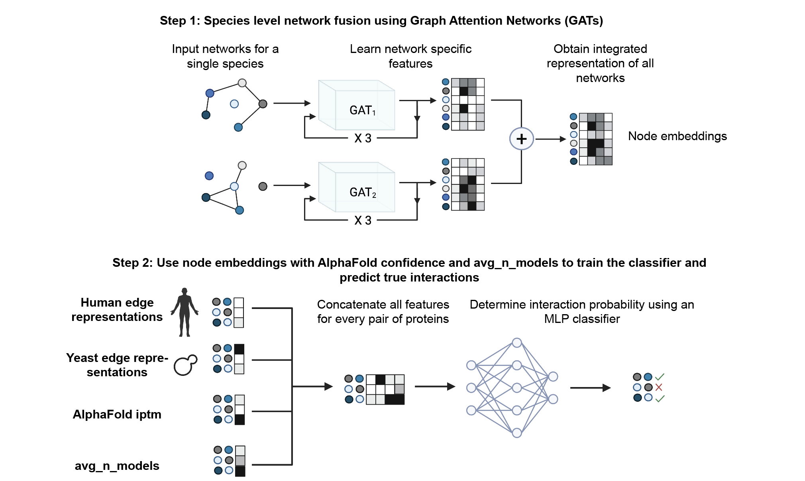

[](https://opensource.org/licenses/MIT)

<!---[]()
[]()
[]()
--->

AlphaORACLE (**Alpha**Fold and **O**rtholog-**R**einforced **A**ttention-**C**lassifier for **L**ink **E**valuation ) is a deep learning classifier for predicting true positive protein-protein interactions (PPIs) from high-throughput AlphaFold-Multimer screens.


<!---
> TBD Reference
--->

[TOC]: #
## Table of Contents
- [Introduction](#motivation)
- [Installation](#installation)
- [Usage](#usage)
  - [Run the pre-trained AlphaORACLE classifier](#run-pre-trained-classifier)
  - [Train AlphaORACLE on user-defined custom networks](#generate-embeddings-from-user-custom-networks)


## Introduction
High-throughput AlphaFold-Multimer screens contain an abundance of false positives and false negatives. To identify true protein-protein interactions (PPIs) from such screens, we present AlphaORACLE - a deep learning classifier trained on structural features from AlphaFold predictions for binary complexes as well as biological features learned by integrating well-curated yeast and human datasets using Graph Attention Networks (GATs). An overview of AlphaORACLE can be seen below.



- In Step 1, individual networks are passed through their own GAT encoders and where network-specific protein features are learned based on the network topologies. These features are passed through the encoder 3 times to produce protein features that incorporate higher-order neighborhoods. These features are then summed to produce integrated protein features that capture topological information across input networks. The training loss function attempts to minimize the difference between the input networks and the reconstructions of these networks using the integrated embeddings.

- In Step 2, the integrated features from yeast and human networks are used to obtain protein-pair representations and combined with 2 additional features from AlphaFold-predicted structures for the protein-pairs predicted structures i.e the AlphaFold interface predicted Template Modeling score (ipTM) and a metric for the average per-contact conservation across the top 3 ranked AlphaFold-Multimer models (avg_n_models). These features are concatenated and supplied to a Multi-Layer Perceptron (MLP) for classifying true and false positive PPIs. For every protein pair, the output is the probability of interaction.


## Installation
AlphaORACLE is implemented in [Python 3.11](https://www.python.org/downloads/) and uses [PyTorch 2.6.0](https://pytorch.org/) and [PyTorch Geometric 2.3](https://pytorch-geometric.readthedocs.io/en/latest/).

### Step 1: Create Anaconda environment
Create an AlphaORACLE environment, gathering necessary dependencies. To speed up dependency resolution, using Mamba is recommended.

```bash
mamba create -n AlphaORACLE -c bioconda -c conda-forge python==3.11
```
### Step 2: Install PyTorch and PyTorch Geometric
To run AlphaORACLE on a CUDA capable GPU install PyTorch and PyTorch Geometric compatible with your CUDA version. In this example we use CUDA 12.4.
```bash
source activate AlphaORACLE
# CUDA 12.4
pip install torch==2.6.0 torchvision==0.21.0 torchaudio==2.6.0 --index-url https://download.pytorch.org/whl/cu124
pip install torch_geometric==2.3.0
pip install torch_scatter torch_sparse torch_cluster -f https://data.pyg.org/whl/torch-2.6.0+cu124.html
```

### Step 3: Install AlphaORACLE locally
Currently, AlphaORACLE can be installed by cloning this repository and installing with pip.
```bash
source activate AlphaORACLE
git clone https://github.com/anjali-nelliat/AlphaORACLE.git
cd AlphaORACLE
python3 pip install -e .
```
Verify the installation by running

```bash
source activate AlphaORACLE
alphaoracle --help
```

## Usage

### Run the pre-trained AlphaORACLE classifier.
AlphaORACLE runs by passing in a configuration file: a JSON file containing all the relevant model file paths and hyperparameters. 
```
alphaoracle predict run_classifier.json
```
An example config file can be found [here](https://github.com/anjali-nelliat/AlphaORACLE/blob/master/config/run_classifier.json).
The configuration keys are as follows:

Argument | Default | Description
--- | :---: | ---
`ortholog_mapping_path` | `"Ortholog_mapping.csv"` | Path to yeast-human ortholog mapping file.
`human_embeddings_path` | `"human_features.csv"` | Path to human embeddings file.
`yeast_embeddings_path` | `"yeast_features.csv"`  | Path to yeast embeddings file.
`af_scores_path` | `None` | Path to AlphaFold iptm file.
`avg_n_models_path` | `None` | Path to average models file.
`input_csv` | `None` | Path to input CSV with protein pairs to predict.
`model_path` | `"optimized_interaction_classifier.pt"` | Path to trained model.
`output_path` | `"interaction_predictions.csv"` | Filepath to save predictions.
`output_dir` | `"./prediction_output"` | Directory to save outputs
`yeast_dim` | `512` | Dimension of yeast protein embeddings.
`human_dim` | `1024` | Dimension of human protein embeddings.
`batch_size` | `32` | Batch size for predictions.


In addition to certain user-supplied input files described below, the classifier requires inputs which are provided either in this repo under the `inputs/` folder: 
- The human-yeast ortholog mapping file called `Ortholog_mapping.csv` 
- The classifier model `optimized_interaction_classifier.pt` 
- The human and yeast embeddings files `embeddings/human_features.csv` and `embeddings/yeast_features.csv` (**NOTE**: These files are too large for GitHub and are downloadable from [Google Drive link to Embeddings](https://drive.google.com/drive/folders/16fARUVTF3G2r76Dt1vwI3bty4MWi_l0x?usp=drive_link))

The 3 required input files supplied by the user are:
1. A csv file of the pairs of interactions to predict. The file consists of 2 columns of Uniprot IDs  with headers Protein1 and Protein2. For example,
```
Protein1,Protein2
P40227,Q9BUK6
P50991,Q9BTY7
```
2. A csv file of the pairs of interactions and their corresponding AlphaFOld-Multimer iptm. For example,
```
Protein1,Protein2,iptm
P40227,Q9BUK6,0.856
P50991,Q9BTY7,0.729
```
3. A csv file of the pairs of interactions and their corresponding avg_n_models score. This score can be calculated from the structures produced by an AlphaFold-Multimer screen using the command:

```
alphaoracle avgmodels analyze_structures.json
```
Here, `analyze_structures.json` is a config file which specifies the inputs to the command. An example can be found [here](https://github.com/anjali-nelliat/AlphaORACLE/blob/master/config/analyze_structures.json).

The configuration keys are as follows:

Argument | Default | Description
--- | :---: | ---
`mode` | `batch` | Analysis mode ('folder' or 'batch'). Batch processes multiple protein complex subfolders within a parent folder.
`folder_path` | `None` | Path to folder with PDB files (for 'folder' mode).
`parent_dir` | `None`  | Path to parent directory containing folders with PDB files (for 'batch' mode).
`output_format` | `"text"` | Output format for folder mode: 'text' or 'csv'.
`output_file` | `"contacts_summary.csv"` | Output file for batch mode.
`detailed` | `False` | Whether to save detailed contact information in individual text files for each complex.
`cutoff` | `8.0` | Distance cutoff in Angstroms to define a contact.
`pdb_prefix` | `"ranked_` | Prefix for PDB files. For example, with AlphaPulldown the outputs are ranked_0.pdb, ranked_1.pdb etc.
`pdb_indices` | `[0, 1, 2]` | Indices for PDB files to analyze.


For `batch` mode, the input parent directory of structures should minimally have folders for each complex where the names are of the format `ProteinA_ProteinB`. Each folder should have at least 3 PDB structures. The .pdb file names/prefixes can be altered in the json input:

```
 alphafold_multimer_output
      |- P40227_Q9BUK6
            |- ranked_0.pdb
            |- ranked_1.pdb
            |- ranked_2.pdb
      |- P50991_Q9BTY7
            |- ranked_0.pdb
            |- ranked_1.pdb
            |- ranked_2.pdb
```

The .csv for avg_n_models scores will look like:
```
Protein1,Protein2,avg_n_models
P40227,Q9BUK6,0.856
P50991,Q9BTY7,0.729
```

The final classifier output is the interaction probability for every protein pair. For example,
```
Protein1,Protein2,Interaction_Probability
P40227,Q9BUK6,0.986
P50991,Q9BTY7,0.985
```


### Train AlphaORACLE on user-defined custom networks
To train the classifier on your own networks, first obtain the protein embeddings for the custom networks. For example:
```
alphaoracle embeddings human_embeddings.json
```
where `human_embeddings.json` is a config file which specifies the inputs to the command. 

The configuration keys are as follows:

Argument | Default | Description
--- | :---: | ---
`input_names` | `None` | A list of input network file paths.
`output_name` | `None` | Path to output folder.
`delimiter` | `" "`  | Column delimiter in input network files.
`epochs` | `1000` | Number of training epochs.
`batch_size` | `2048` | Number of proteins in each batch. Higher numbers result in faster training but also higher memory usage.
`learning_rate` | `0.0005` | Learning rate. Higher learning rates result in faster convergence but run the risk of unstable training.
`embedding_size` | `512` | Dimensionality of the learned integrated protein features.
`neighbor_sample_size` | `2` | Size of neighborhoods to sample around each node for progressive GAT passes per training step.
`gat_shapes.dimension` | `128` | Dimensionality of each individual GAT head.
`gat_shapes.n_heads` | `10` | Number of attention heads for each network-specific GAT.
`gat_shapes.n_layers` | `3` | Number of times each network is passed through its corresponding GAT. This number corresponds to the effective neighbourhood size of the convolution.
`save_model` | `true` | Whether to save the trained model parameters and state.
`pretrained_model_path` | `None` | Path to a pretrained model (.pt file) to load parameters from.
`plot_loss` | `true` | Whether to plot the model loss curves after training.
`save_loss_data` | `false` | Whether to save the training loss data in a .tsv file.

The `.` notation indicates a nested field, so `gat_shapes.dimension` (for example) in becomes

```
gat_shapes: {
    dimension: ${DIM_VALUE}
}
```

in the config file. An example config file can be found [here](https://github.com/anjali-nelliat/AlphaORACLE/blob/master/config/human_embeddings.json).
